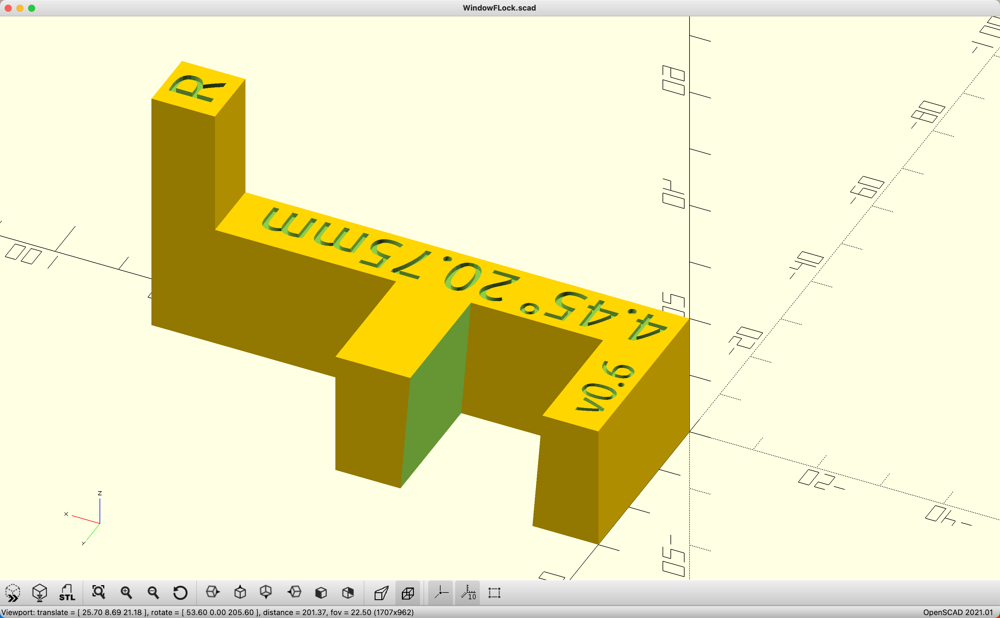
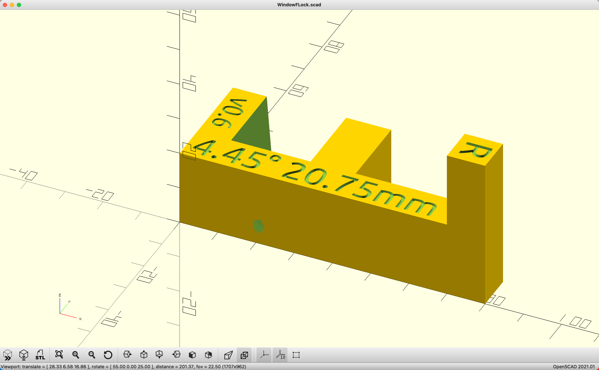

# 3D model - Parametric Window F-Lock

Check it out on [Printables.com](https://www.printables.com/model/905381-parametric-window-f-lock)

Preview from OpenSCAD: 

 

## Model origin and licence

This model is heavily inspired by [Window lock // Fensterarretierung](https://www.printables.com/model/102126-window-lock-fensterarretierung) designed by [WVRPrinter](https://www.printables.com/@WVRPrinter_146394). It was originally licensed under CC-BY-NC and I treat my inspired work as a remix.

## Idea

It's a simple attachment for standard tilt windows aimed at preventing window slamming during strong drafts. One of the main goals of general design was to have it easy to attach and detach without any impact on the window. The name comes from the top-view shape of the letter F.

Additionally, this model is fully parametric, thus easy to adjust for most of standard windows, including tilt angle, size and the option to choose left or right side of window.

## Features/parts

- clamp - part that clamps window frame and gasket
- pusher - long finger that connects clamp and touches jamb (wall part) 
  - hole for lanyard - to make it easier to pull off window and to hang it on window handle when not in use
  - on top there are object parameters embossed
- jamb bumper - extended touch area of pusher
  - on top there's window side marker

## Customization

Base parameters for user to adjust:

- `full_length` - longest edge of whole object, depends on point of window you want to attach it (default 80mm makes it work at 1/3 from bottom on my window)
- `window_frame_thickness` - thickness of window frame plus gasket - measure with calipers, my suggestion is to slightly squeeze gasket with calipers not to make it too loose
- `window_open_angle` - how many degrees the window opens in tilt mode
  - use power of trigonometry, goniometer, protractor or easy mode - digital protractor (they are surprisingly cheap) to measure your window
  - when using digital protractor, subtract angle your window frame is deviating from straight - buildings rarely have true straight angles!
  - in my case it's `4.45°` and the code was tested to render reasonable slopes up to 20°; however, above 15° current logic starts to make clamp asymmetrical
- `use_on_right_side_of_window` - `true` if lock is to be attached on right side of window, `false` if on left
  - usually there's only one window in pair that's tilting, and it's easier to put lock on centre of window pair, rather than from wall side; however, any of two can be tiltable, hence this parameter

Other parameters are left in code for fine-tuning. For ease of prototyping, core parameters (except length) are embossed to the object.

## Printing

In-place printing without supports. 

It worked fine with Hyper PLA-CF, although probably any similar material will work. Everything printed fine, even at 0.24mm layer; however, for small diagonal lanyard hole, I'd recommend going with 0.16-0.20mm.

10% in-fill should be sufficient, I stuck with Cross-Hatch from Orca Slicer.
